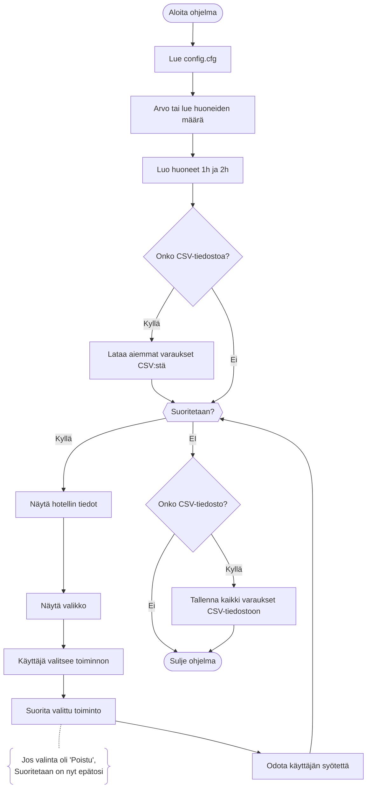

# Hotellihuoneen varausohjelma (C++)

C++ ohjelma hotellihuoneen varausjärjestelmästä, jossa voi luoda ja hallita varauksia.


_Kuva hotellihuoneen varausohjelmasta_

---

## Sisällysluettelo

1. [Yleistä tietoa](#yleistä-tietoa)
2. [Asennus](#asennus)
3. [Ohjelman toiminta](#ohjelman-toiminta)
4. [Laajennettavuus](#laajennettavuus)

---

## Yleistä tietoa

Hotellihuoneen varausohjelma on C++ kielellä tehty komentorivisovellus, jossa pystyy hallitsemaan hotellihuoneiden varauksia. Ohjelma on tehty C++-ohjelmoinnin perusteet kurssin loppytyönä ja se tavoittelee arvosanaa 5.

### Toiminnot

- **Varausten luominen** - Käyttäjä voi varata yhden tai kahden hengen huoneen
- **Varausten hallinta** - Varauksia voi tarkastella, hakea ja poistaa
- **Tietojen tallennus** - Varaukset voidaan tallentaa CSV-tiedostoon
- **Config-tiedosto** - Config-tiedostossa voi muokata ohjelman asetuksia

### Ominaisuudet

- **Huoneiden määrä**: Ohjelma arpoo huoneiden määrän ellei config tiedostossa sitä ole jo määritelty.
- **Kahdenlaisia huoneita**:
   
  - Yhden hengen huoneet: 100 €/yö
  - Kahden hengen huoneet: 150 €/yö
  
- **Varausnumerot**: Automaattisesti arvotut varausnumerot
- **Automaattinen hinnoittelu** - Ohjelma laskee automaattisesti varausten hinnat ja arpoo satunnaiset alennukset
- **Virheenkäsittely** - Kattava virheen käsittely (`exceptions.hpp` tiedosto sisältää omia Exception luokkia)

---

## Asennus

#### 1. Lataa projekti

```bash
git clone https://github.com/Ossi05/cpp-hotellihuoneen-varausohjelma.git
cd cpp-hotellihuoneen-varausohjelma
```

#### 2. Muokkaa config tiedostoa

Muokkaa `config.cfg` tiedostoa:

Esimerkki tiedoston sisällöstä:

```
HOTEL_NAME=C++ hotelli
MIN_ROOMS_AMT=40
MAX_ROOMS_AMT=300
CSV_FILE_NAME=testi.csv
SALE_PERCENTAGES=0 10 20
MAX_RESERVATION_ID=99999
MIN_RESERVATION_ID=10000
```

**Konfiguraatioparametrit:**

**Pakolliset parametrit:**

- `HOTEL_NAME` - Hotellin nimi
- `MIN_ROOMS_AMT` - Huoneiden vähimmäismäärä
- `MAX_ROOMS_AMT` - Huoneiden enimmäismäärä
- `MIN_RESERVATION_ID` - Pienin varausnumero
- `MAX_RESERVATION_ID` - Suurin varausnumero

**Valinnaiset parametrit:**

- `SALE_PERCENTAGES` - Alennusprosentit (välilyönnillä erotettuna)
- `CSV_FILE_NAME` - CSV-tiedoston nimi varauksien tallennukseen
- `TOTAL_ROOM_AMT` - Huoneiden tarkka määrä (muutoin arvotaan MIN ja MAX väliltä)

---

## Ohjelman toiminta

### Rakenne

1. **HotelApp** - Pääohjelma, joka hallitsee ohjelman suoritusta
2. **Hotel** - Hotellin tiedot, huoneiden ja varausten hallinta
3. **Room** - Yksittäinen huone ja sen tiedot
4. **Reservation** - Yksittäinen varaus ja sen tiedot
5. **ReservationManager** - Varausten hallinta
6. **Menu** - Valikon näyttäminen ja hallinta
7. **Config** - Config-tiedoston lukeminen ja hallinta
8. **CSVReservationHandler** - Varausten tallennus ja lukeminen CSV-tiedostosta

#### Huoneiden tallennus:

- Huoneet tallennetaan `Hotel`-luokan sisällä `std::unordered_map<RoomType, std::vector<std::shared_ptr<Room>>>` -rakenteeseen
  -- Avaimena on huoneentyyppi
  -- Arvona on huoneet
- Huoneet luodaan ohjelman käynnistyessä `Hotel::generate_rooms()` -funktiossa
- Huoneet jaetaan tasaisesti eri huonetyyppeihin

#### Varausten tallennus:

- Varaukset tallennetaan `ReservationManager`-luokan sisällä `std::unordered_map<int, std::shared_ptr<Reservation>>` -rakenteeseen
  -- Avaimena on varausnumero
  -- Arvona on varaukset
- Varaukset tallennetaan myös CSV-tiedostoon haluttaessa. Tallennuksesta vastaa `CSVReservationHandler` luokka

#### Varausten hallinta

- Varausnumerot generoidaan satunnaisesti
- Ohjelma tarkistaa, että varausnumero ei ole jo käytössä

#### Hinnoittelu ja alennukset

- Ohjelma arpoo varauksen luomisen yhteydessä alennusprosentin `config.cfg` tiedoston tietojen perusteella
- Perushinnat **(katso Room.cpp)**:
  - Yhden hengen huone: 100 €/yö
  - Kahden hengen huone: 150 €/yö
- Loppuhinta = (Perushinta \* Öiden määrä ) - alennus

### Ohjelman kulku

1. **Alustus**:

   - Luetaan `config.cfg` tiedosto
   - Arvotaan huoneiden määrä (tai luetaan config-tiedostosta)
   - Luodaan huoneet
   - Ladataan aiemmat varaukset CSV-tiedostosta (jos saatavilla)

2. **Pääsilmukka**:

   - Näytetään hotellin tiedot
   - Näytetään valikko vaihtoehtoineen
   - Käyttäjä valitsee toiminnon
   - Suoritetaan valittu toiminto
   - Odotetaan käyttäjän syötettä ennen jatkamista
   - Palataan takaisin valikkoon (jos valinta ei ollut poistu)

3. **Lopetus**:
   - Tallennetaan kaikki varaukset CSV-tiedostoon (valinnainen)
   - Suljetaan ohjelma

<details>
   <summary>Paina nähdäksesi ohjelman Flowchartin</summary>



</details>

---

### Laajennettavuus

**Uuden huonetyypin lisääminen:**

Muokkaa `Room.cpp`-tiedostoa:

```cpp
std::unordered_map<RoomType, RoomTypeData> Room::ROOM_TYPE_DATA = {
    { RoomType::Single, {"Yhden hengen", 100.0} },
    { RoomType::Double, {"Kahden hengen", 150.0} },
    { RoomType::Triple, {"Kolmen hengen", 200.0} } // Uusi tyyppi
};
```

**Uuden valikkotoiminnon lisääminen:**

Muokkaa `HotelApp.cpp`-tiedoston konstruktoria:

```cpp
menu{ {
    { "Luo varaus", [this]() { create_reservation(); } },
    { "Uusi toiminto", [this]() { std::cout << "Uusi toiminto" } }, // Uusi toiminto
    { "Poistu ohjelmasta", [this]() { handle_exit_program(); }}
} }
```

